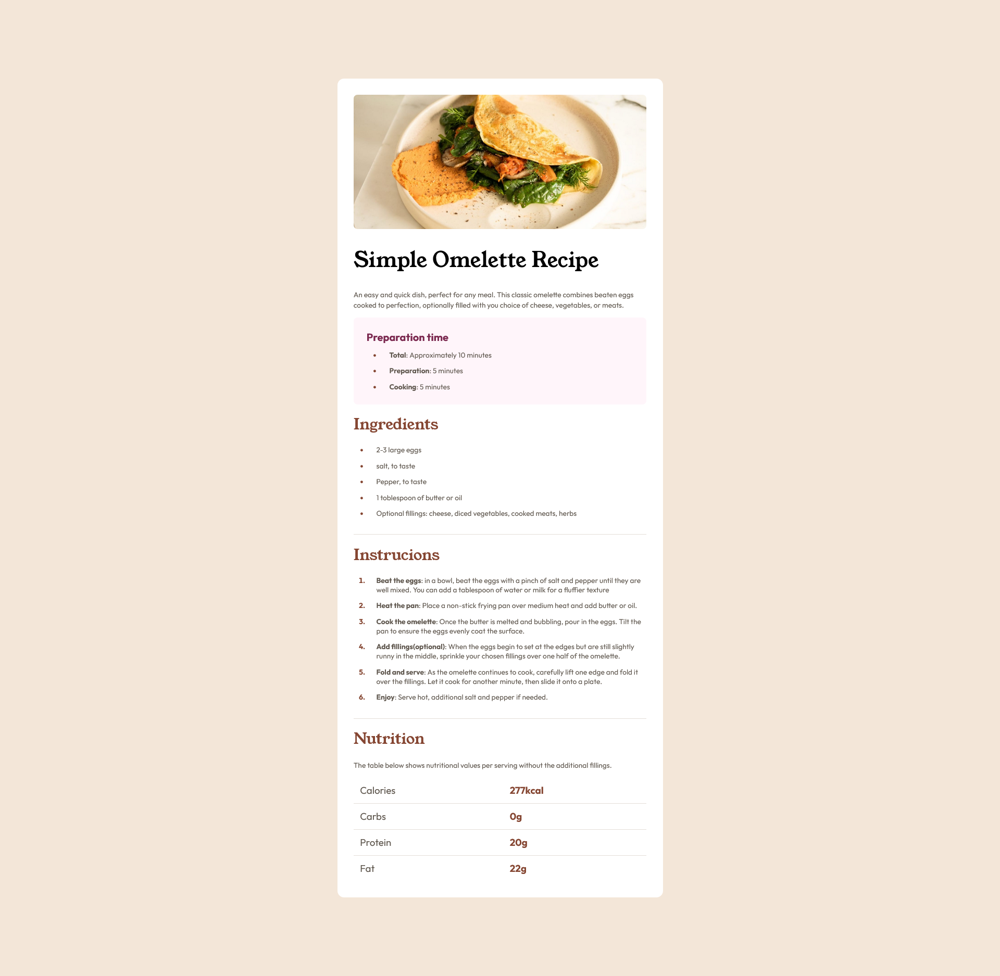

# Frontend Mentor - Recipe page solution

### Links

- Solution URL: (https://frontendmentor.io/solutions/recipe-page-using-different-types-of-elements-V59pAXAY4q)
- Live Site URL: (https://aallam0.github.io/Recipe-page)

### Useful resources

- (https://elzero.org)

### Author

- Frontend Mentor - [@aAllam0](https://www.frontendmentor.io/profile/aAllam0)

